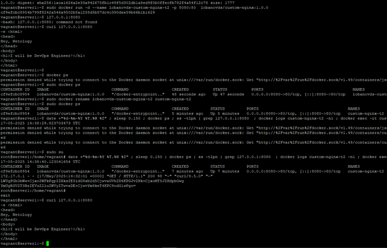
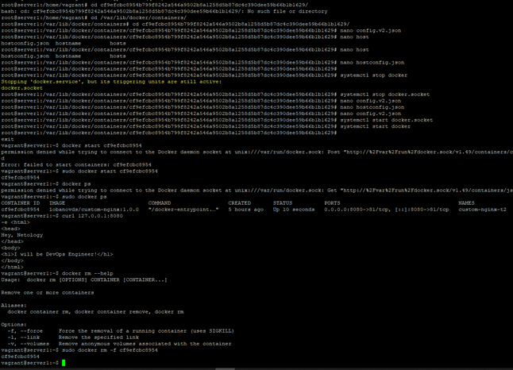
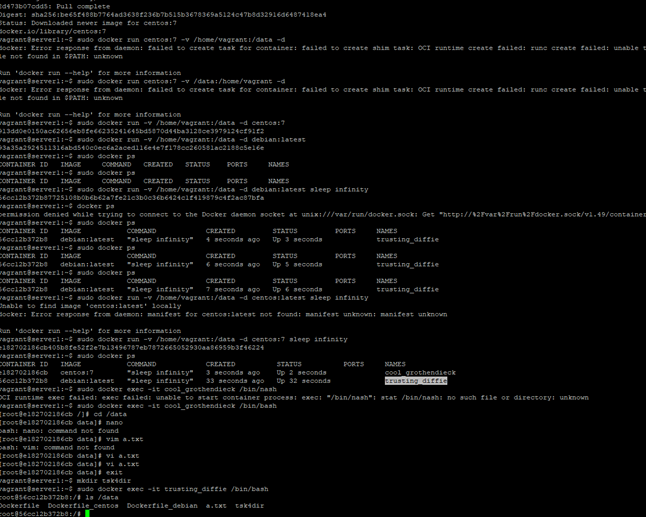
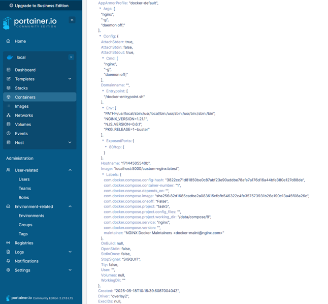
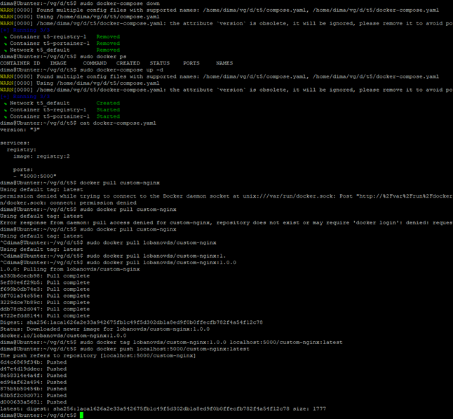

# Решение домашнего задания к занятию 4 «Оркестрация группой Docker контейнеров на примере Docker Compose»

## Решение Задачи 1
Воспользовался виртуалкой Vagrant из прошлого задания в которой уже есть docker-compose И прочие утилиты
-	vagrant ssh 
-	sudo docker pull nginx:1.21.1 #скачал образ из репозитория, значит не нужно проводить доп действий
-	Создал докер файл:
```
FROM nginx:1.21.1
RUN echo -e '<html>\n<head>\nHey, Netology\n</head>\n<body>\n<h1>I will be DevOps Engineer!</h1>\n</body>\n</html>' > /usr/share/nginx/html/index.html
EXPOSE 80
CMD ["nginx", "-g", "daemon off;"]
```
Параметр _daemon off_ чтобы nginx не работал в фоновом режиме, а мы могли отслеживать логи процесса через STDOUT 
- Создал образ с тегом lobanovds/custom-nginx:1.0.0
- Проверил, что система запускается, запустив 
```
sudo docker run lobanovds/custom-nginx:1.0.0
```
-	Получил логи
```
/docker-entrypoint.sh: /docker-entrypoint.d/ is not empty, will attempt to perform configuration
/docker-entrypoint.sh: Looking for shell scripts in /docker-entrypoint.d/
/docker-entrypoint.sh: Launching /docker-entrypoint.d/10-listen-on-ipv6-by-default.sh
10-listen-on-ipv6-by-default.sh: info: Getting the checksum of /etc/nginx/conf.d/default.conf
10-listen-on-ipv6-by-default.sh: info: Enabled listen on IPv6 in /etc/nginx/conf.d/default.conf
/docker-entrypoint.sh: Launching /docker-entrypoint.d/20-envsubst-on-templates.sh
/docker-entrypoint.sh: Launching /docker-entrypoint.d/30-tune-worker-processes.sh
/docker-entrypoint.sh: Configuration complete; ready for start up
2025/05/17 14:22:17 [notice] 1#1: using the "epoll" event method
2025/05/17 14:22:17 [notice] 1#1: nginx/1.21.1
2025/05/17 14:22:17 [notice] 1#1: built by gcc 8.3.0 (Debian 8.3.0-6)
2025/05/17 14:22:17 [notice] 1#1: OS: Linux 6.8.0-31-generic
2025/05/17 14:22:17 [notice] 1#1: getrlimit(RLIMIT_NOFILE): 1048576:1048576
2025/05/17 14:22:17 [notice] 1#1: start worker processes
2025/05/17 14:22:17 [notice] 1#1: start worker process 31
```
- Залогинился через браузер в докерхаб и получил токен
Далее в линуксе: 
 
```docker login -u lobanovds```
- Ввел токен
- Запушил образ в регистри

```docker push lobanovds/custom-nginx:1.0.0```

- Проверил, на сайте образ появился тоже https://hub.docker.com/repository/docker/lobanovds/custom-nginx/general

## Решение Задачи 2


- Запускаю докер в фоне с портом 8080 на локалхосте и с моим именем контейнера

```sudo docker run -d --name lobanovds-custom-nginx-t2 -p 8080:80  lobanovds/custom-nginx:1.0.0```
- проверяю что всё работает: так как зашёл по SSh могу посмотреть через CURL
 
```curl 127.0.0.1:8080```

-	Переименовал
```
sudo docker rename lobanovds-custom-nginx-t2 custom-nginx-t2
sudo docker ps
CONTAINER ID   IMAGE                          COMMAND                  CREATED         STATUS         PORTS                                     NAMES
cf9efcbc8954   lobanovds/custom-nginx:1.0.0   "/docker-entrypoint.…"   5 minutes ago   Up 5 minutes   0.0.0.0:8080->80/tcp, [::]:8080->80/tcp   custom-nginx-t2
```
-	выполнил указанную команду под рутом вывод:
```
vagrant@server1:~$ sudo su
root@server1:/home/vagrant# date +"%d-%m-%Y %T.%N %Z" ; sleep 0.150 ; docker ps ; ss -tlpn | grep 127.0.0.1:8080  ; docker logs custom-nginx-t2 -n1 ; docker exec -it custom-nginx-t2 base64 /usr/share/nginx/html/index.html
17-05-2025 14:38:40.123041654 UTC
CONTAINER ID   IMAGE                          COMMAND                  CREATED         STATUS         PORTS                                     NAMES
cf9efcbc8954   lobanovds/custom-nginx:1.0.0   "/docker-entrypoint.…"   7 minutes ago   Up 7 minutes   0.0.0.0:8080->80/tcp, [::]:8080->80/tcp   custom-nginx-t2
172.17.0.1 - - [17/May/2025:14:32:01 +0000] "GET / HTTP/1.1" 200 98 "-" "curl/8.5.0" "-"
LWUgPGh0bWw+CjxoZWFkPgpIZXksIE5ldG9sb2d5CjwvaGVhZD4KPGJvZHk+CjxoMT5JIHdpbGwg
YmUgRGV2T3BzIEVuZ2luZWVyITwvaDE+CjwvYm9keT4KPC9odG1sPgo=
```



## Решение Задачи 3
- Присоединяюсь к потоку
```sudo docker attach custom-nginx-t2```
- нажимаю ctrl+c. Так как в данном режиме приложение слушает std-in а мы туда отправляем ctrl+c – приложение завершается, а значит для и контейнера нет причины работать. Он останавливается
- перезапустил контейнер
```sudo docker restart custom-nginx-t2```

- зашёл в bash 
```
sudo docker exec -it custom-nginx-t2 /bin/bash
apt update
apt install vim
```
сменил порт и перезагрузил Nginx
Суть проблемы в том, что контейнер настроен на проброс внутреннего порта 80, а Nginx перенастроился на 81, в результате 8080 смотрел в закрытый порт
По инструкции исправил порт без удаления контейнера. Правда пока не представляю ситуацию, где такое может пригодиться, но буду знать.
Удалил работающий контейнер с флагом -f



## Решение Задачи 4

В результате выполнения каждый контейнер видит содержимое данной директории

## Решение Задачи 5



Очень расстроен тем, что не было рассказано ни про портейнер, ни про то что за образ registry мы качаем ни про то, как заводить в него образы докера. 
Вместо того, чтобы быстро сделать задачу я долго думал, что неправильно раскатил образы, оказалось в регистри не было образа, 
пришлось закачивать его туда самостоятельно и разбираться с этим. Можно было хотябы намекнуть что ожидается от выполнения или что в регистри образы автоматически не подтягиваются.


