# Домашнее задание к занятию 5. «Практическое применение Docker»

### Инструкция к выполнению

1. Для выполнения заданий обязательно ознакомьтесь с [инструкцией](https://github.com/netology-code/devops-materials/blob/master/cloudwork.MD) по экономии облачных ресурсов. Это нужно, чтобы не расходовать средства, полученные в результате использования промокода.
3. **Своё решение к задачам оформите в вашем GitHub репозитории.**
4. В личном кабинете отправьте на проверку ссылку на .md-файл в вашем репозитории.
5. Сопроводите ответ необходимыми скриншотами.

---
## Примечание: Ознакомьтесь со схемой виртуального стенда [по ссылке](https://github.com/netology-code/shvirtd-example-python/blob/main/schema.pdf)

---

## Задача 0
1. Убедитесь что у вас НЕ(!) установлен ```docker-compose```
_система запущена на образе из Packer в котором docker-compose Отсутствует_  

2. Убедитесь что у вас УСТАНОВЛЕН ```docker compose```(без тире) версии не менее v2.24.X, для это выполните команду ```docker compose version```
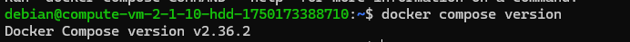
---

## Задача 1
1. Сделайте в своем GitHub пространстве fork [репозитория](https://github.com/netology-code/shvirtd-example-python).
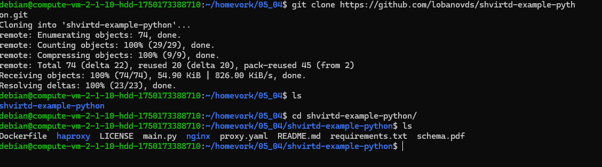
2. Создайте файл ```Dockerfile.python``` на основе существующего `Dockerfile`:
   - Использовал базовый образ ```python:3.12-slim```
   - И конструкцию ```COPY . /opt/app``` в Dockerfile 
   - Создал `.dockerignore` файл для исключения файлов
    
   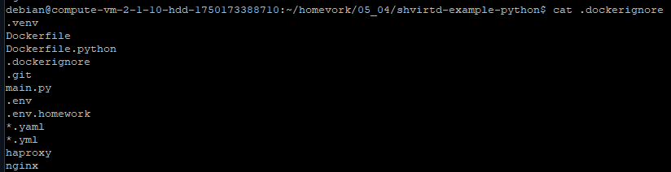
   - Используйте ```CMD ["uvicorn", "main:app", "--host", "0.0.0.0", "--port", "5000"]``` для запуска
   - Протестировал корректность сборки
   
   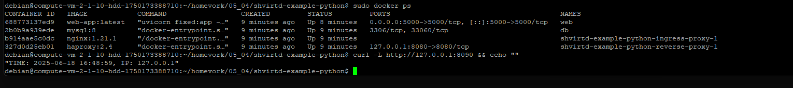
Уточнение: Для того, чтобы не городить огороды с поиском оптимального предварительного времени настройки БД, 
так как в этот момент БД уже считается запущенной и проект начинает работать, но не может создать таблицу в БД,
ведь пользователь ещё не создан при инициализации. 
Я помимо замены таблицы requests на переменную, добавил инструкцию exit(1) в случае, если скрипт не смог создать таблицу.
Таким образом сервис гарантированно будет работать только в случае успешного полноценного подключения к БД.
   
3. (Необязательная часть, *) Изучите инструкцию в проекте и запустите web-приложение без использования docker, с помощью venv. (Mysql БД можно запустить в docker run). 

Установил Python-venv

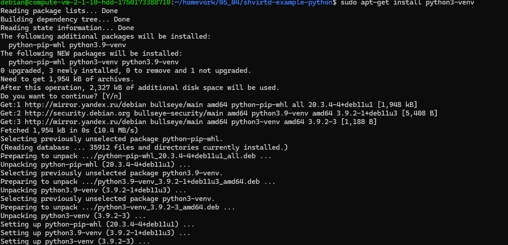

Перешёл на .venv и установил нужные пакеты 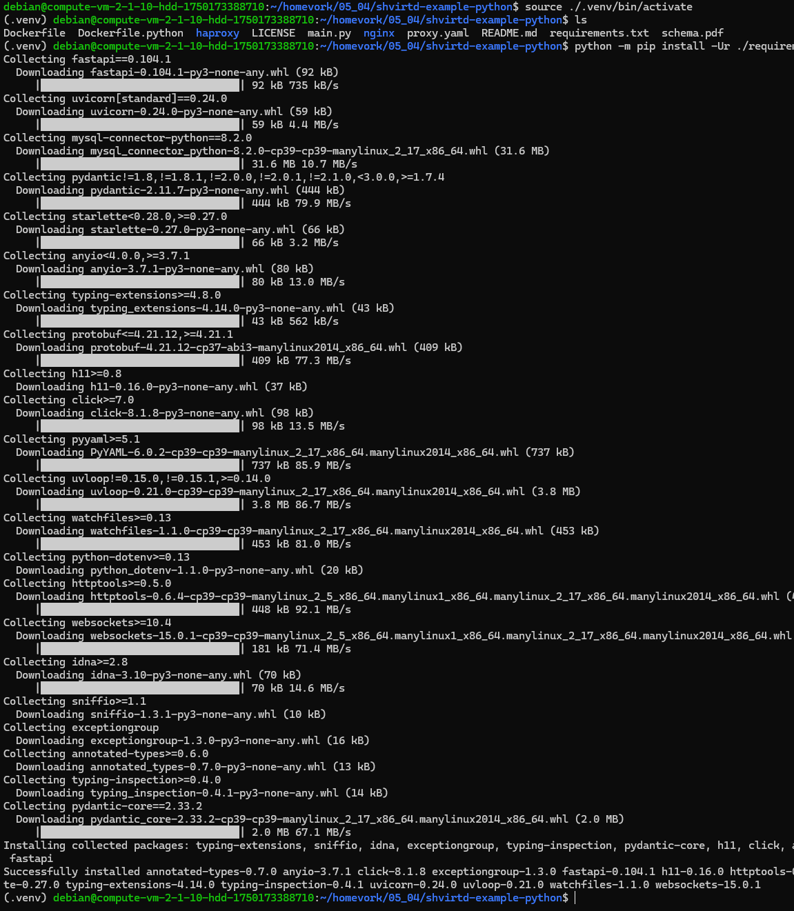

Запустил приложение, оно затребовало доступ к Базе данных

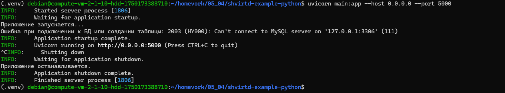

Здесь список получившихся файлов в директории /opt/app с учётом .dockerignore
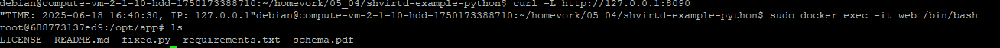

4. (Необязательная часть, *) Изучите код приложения и добавьте управление названием таблицы через ENV переменную.
    - Добавил в код управление именем таблицы везде где использовалось requests, даже в текстовом описании события 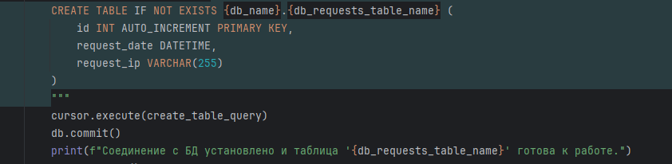 
---
### ВНИМАНИЕ!
!!! В процессе последующего выполнения ДЗ НЕ изменяйте содержимое файлов в fork-репозитории! Ваша задача ДОБАВИТЬ 5 файлов: ```Dockerfile.python```, ```compose.yaml```, ```.gitignore```, ```.dockerignore```,```bash-скрипт```. Если вам понадобилось внести иные изменения в проект - вы что-то делаете неверно!
---

## Задача 2 (*)
1. Создал registry с именем "test" с помощью "yc tool" . [Инструкция](https://cloud.yandex.ru/ru/docs/container-registry/quickstart/?from=int-console-help)

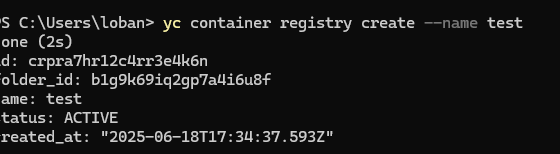
2. Настроил аутентификацию вашего локального docker в yandex container registry. 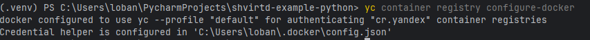
3. Собрал и залил в него образ с python приложением из задания №1.

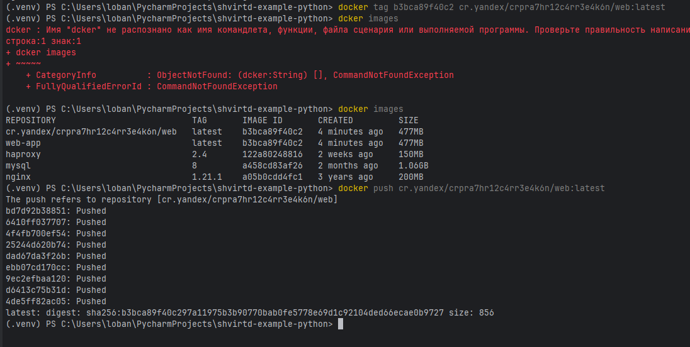
4. Просканировал образ на уязвимости. 
5. Отчет сканирования.[vulnerabilities.csv](vulnerabilities.csv)

## Задача 3
1. Изучите файл "proxy.yaml"
2. Создайте в репозитории с проектом файл ```compose.yaml```. С помощью директивы "include" подключите к нему файл "proxy.yaml".
3. Опишите в файле ```compose.yaml``` следующие сервисы: 

- ```web```. Образ приложения должен ИЛИ собираться при запуске compose из файла ```Dockerfile.python``` ИЛИ скачиваться из yandex cloud container registry(из задание №2 со *). Контейнер должен работать в bridge-сети с названием ```backend``` и иметь фиксированный ipv4-адрес ```172.20.0.5```. Сервис должен всегда перезапускаться в случае ошибок.
Передайте необходимые ENV-переменные для подключения к Mysql базе данных по сетевому имени сервиса ```web``` 

- ```db```. image=mysql:8. Контейнер должен работать в bridge-сети с названием ```backend``` и иметь фиксированный ipv4-адрес ```172.20.0.10```. Явно перезапуск сервиса в случае ошибок. Передайте необходимые ENV-переменные для создания: пароля root пользователя, создания базы данных, пользователя и пароля для web-приложения.Обязательно используйте уже существующий .env file для назначения секретных ENV-переменных!

4. Запустите проект локально с помощью docker compose , добейтесь его стабильной работы: команда ```curl -L http://127.0.0.1:8090``` должна возвращать в качестве ответа время и локальный IP-адрес. Если сервисы не стартуют воспользуйтесь командами: ```docker ps -a ``` и ```docker logs <container_name>``` . Если вместо IP-адреса вы получаете информационную ошибку --убедитесь, что вы шлете запрос на порт ```8090```, а не 5000.

5. Подключитесь к БД mysql с помощью команды ```docker exec -ti <имя_контейнера> mysql -uroot -p<пароль root-пользователя>```(обратите внимание что между ключем -u и логином root нет пробела. это важно!!! тоже самое с паролем) . Введите последовательно команды (не забываем в конце символ ; ): ```show databases; use <имя вашей базы данных(по-умолчанию example)>; show tables; SELECT * from requests LIMIT 10;```.

6. Остановите проект. В качестве ответа приложите скриншот sql-запроса.

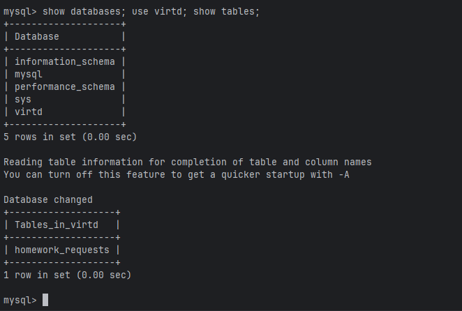

## Задача 4
1. Запустите в Yandex Cloud ВМ (вам хватит 2 Гб Ram).
2. Подключитесь к Вм по ssh и установите docker.
3. Напишите bash-скрипт, который скачает ваш fork-репозиторий в каталог /opt и запустит проект целиком. 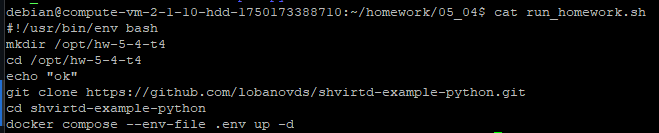
4. Зайдите на сайт проверки http подключений, например(или аналогичный): ```https://check-host.net/check-http``` и запустите проверку вашего сервиса ```http://<внешний_IP-адрес_вашей_ВМ>:8090```. Таким образом трафик будет направлен в ingress-proxy. Трафик должен пройти через цепочки: Пользователь → Internet → Nginx → HAProxy → FastAPI(запись в БД) → HAProxy → Nginx → Internet → Пользователь 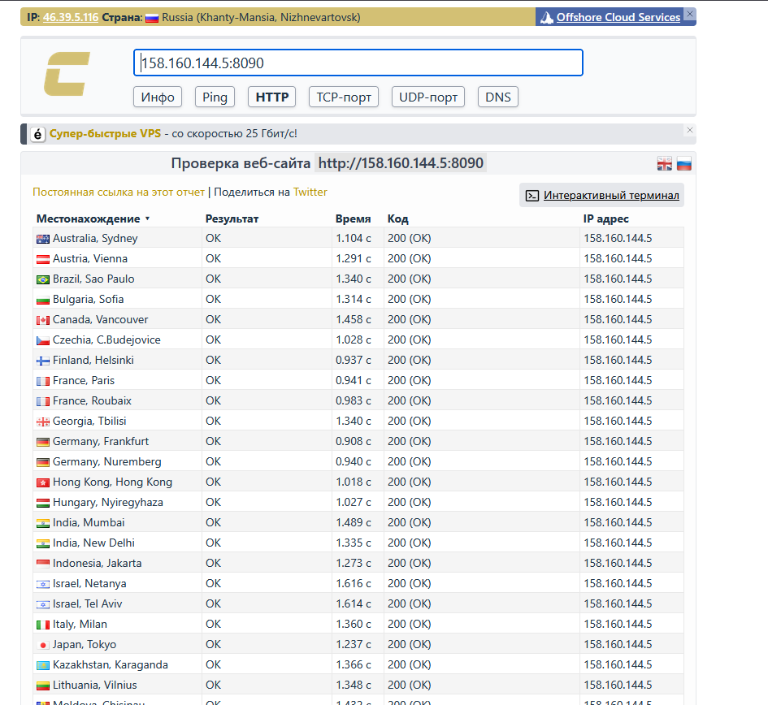
5. (Необязательная часть) Дополнительно настройте remote ssh context к вашему серверу. Отобразите список контекстов и результат удаленного выполнения ```docker ps -a```
6. Повторите SQL-запрос на сервере и приложите скриншот и ссылку на fork. 

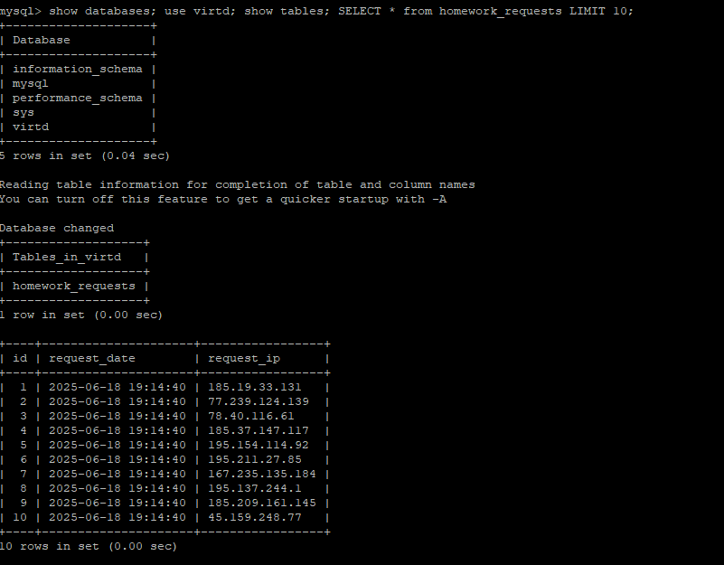

ссылка на форк: https://github.com/lobanovds/shvirtd-example-python

## Задача 5 (*)
1. Напишите и задеплойте на вашу облачную ВМ bash скрипт, который произведет резервное копирование БД mysql в директорию "/opt/backup" 
с помощью запуска в сети "backend" контейнера из образа ```schnitzler/mysqldump``` при помощи ```docker run ...``` команды. Подсказка: "документация образа."
2. Протестируйте ручной запуск

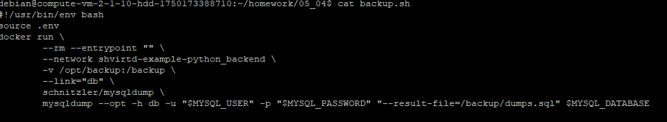
3. Настройте выполнение скрипта раз в 1 минуту через cron, crontab или systemctl timer. Придумайте способ не светить логин/пароль в git!!


4. Предоставьте скрипт, cron-task и скриншот с несколькими резервными копиями в "/opt/backup"

- Код с учётом даты для резервных копий, для упрощения взял юникс тайм. пароли итп берутся из .env, путь до него абсолютный - это важно

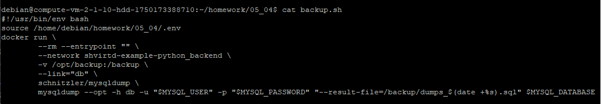

- крон-таск:
<code> * * * * * /home/debian/homework/05_04/backup.sh</code>

- Копии:

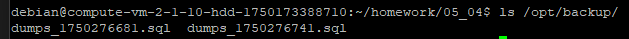

## Задача 6
Скачайте docker образ ```hashicorp/terraform:latest``` и скопируйте бинарный файл ```/bin/terraform``` на свою локальную машину, используя dive и docker save.

  - на локальной машине в dive метод Extract File не работает и не сохраняет файл, хотя судя по коду он сохраняет его в той же директории из которой был вызван dive.exe
  - 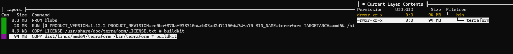

  - Save:
  - 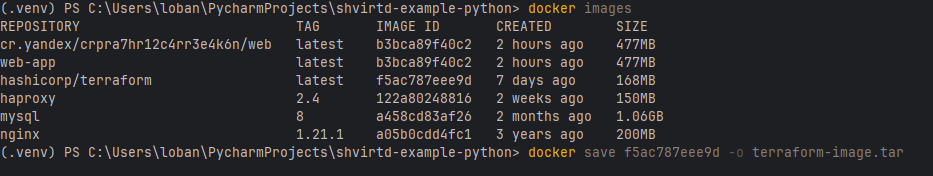 
  - Далее распаковал архив, нашёл последний слой согласно dive так как файл копировался там, указал слой как .tar архив и внутри нашёл искомый файл
  - 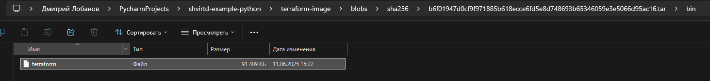

## Задача 6.1
Добейтесь аналогичного результата, используя docker cp.  

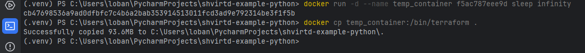
## Задача 6.2 (**)
Предложите способ извлечь файл из контейнера, используя только команду docker build и любой Dockerfile.
Предоставьте скриншоты  действий .

Dockerfile

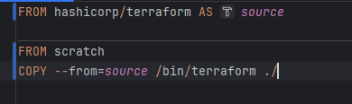

Команда

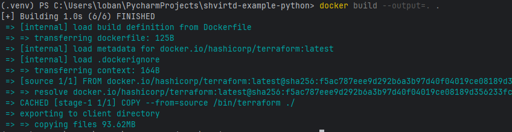


## Задача 7 (***)
Запустите ваше python-приложение с помощью runC, не используя docker или containerd.  
Предоставьте скриншоты  действий .

Это уже потом, очень много времени потратил на выполнение других задач